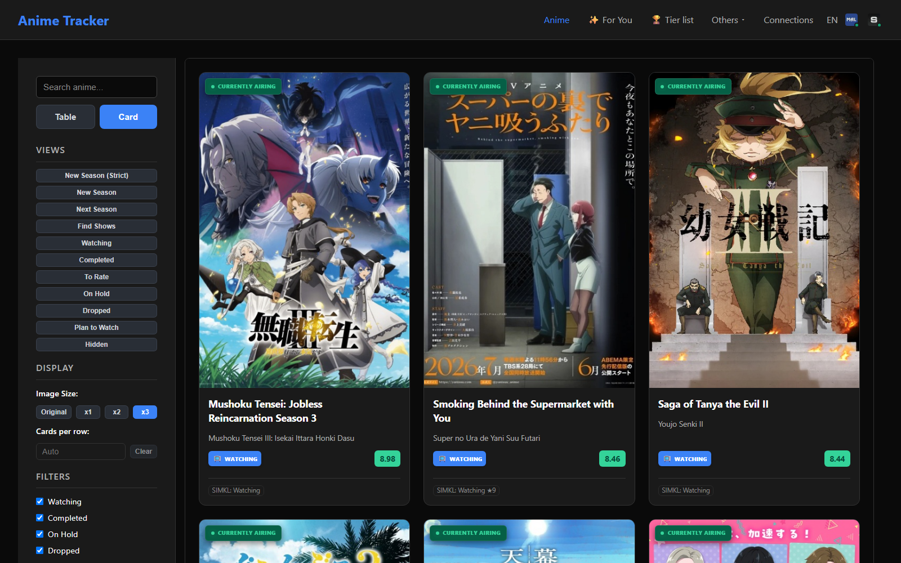
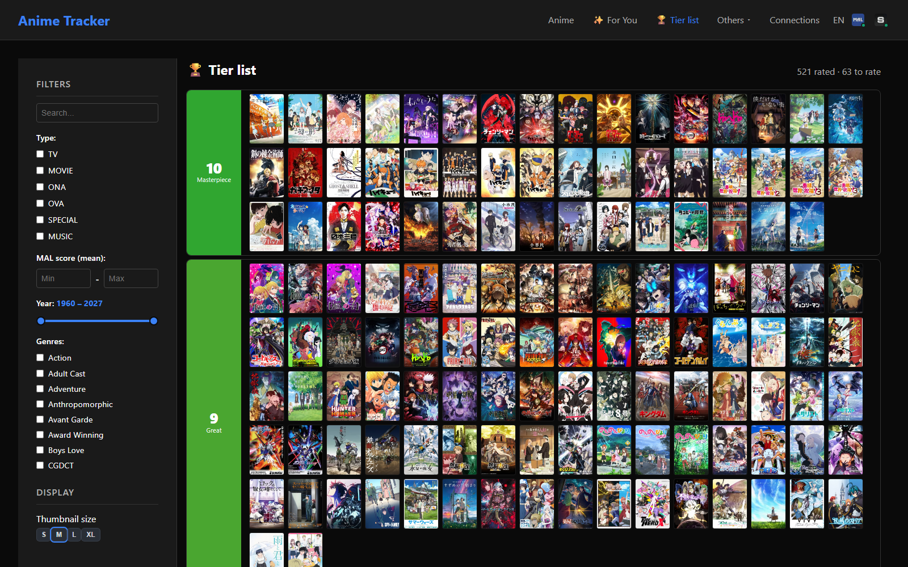
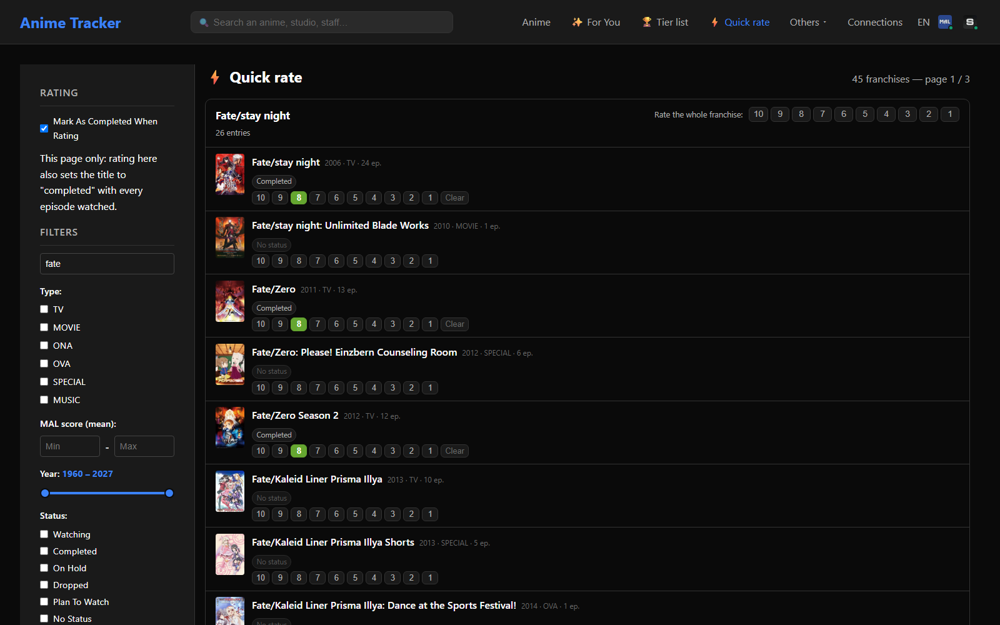
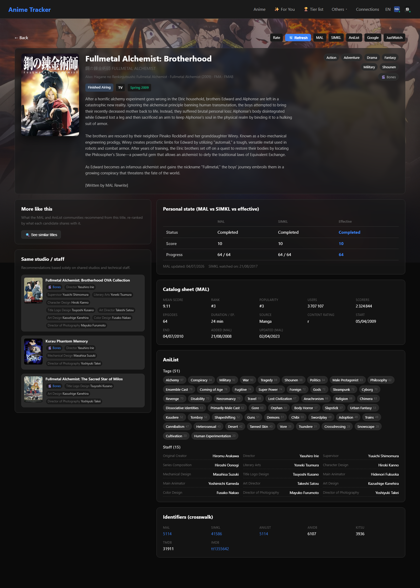
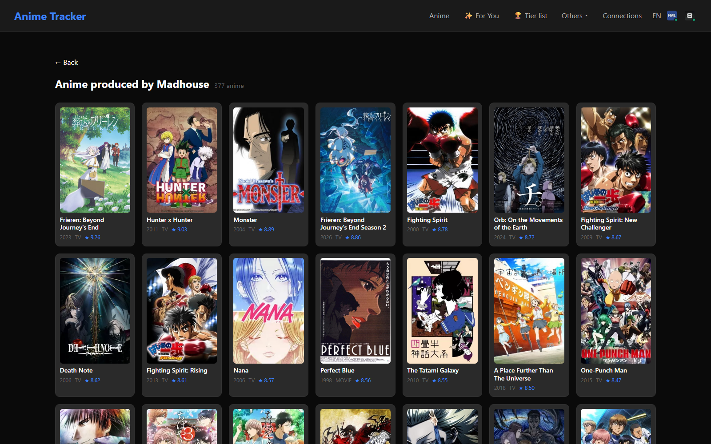
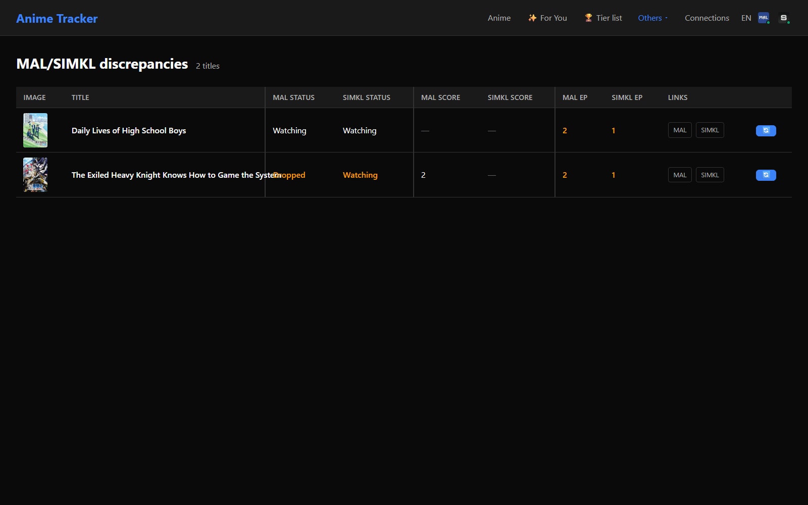

# Anime Tracker

> A self-hosted anime tracking app that unifies **MyAnimeList**, **SIMKL**, and **AniList** into one catalog — with a taste-aware recommendation engine, a drag-and-drop rating board, franchise-wide bulk rating, and cross-source discrepancy detection. It also works with **no external account at all**, using its own local rating store.

<p>
  
  
  
  
  
</p>

Built with **Next.js 14 (Pages Router)** and **TypeScript**, deployed via **Docker** on a Synology NAS. It's a single-user, self-hosted app optimized for a living-room TV browser at 4K — dark theme, keyboard/remote friendly — but it runs anywhere.

The whole thing ships with just **three runtime dependencies** (`next`, `react`, `react-dom`). The i18n layer, URL state management, drag-and-drop rating board, and the recommendation engine are all hand-rolled — no state library, no UI kit, no database.



---

## Features

### 📚 One catalog, four providers

The app merges several data sources into a single unified record per title:

| Source | Role | What it contributes |
|---|---|---|
| **MyAnimeList** | Catalog authority · read + write | The anime catalog, mean scores, genres, studios, seasonal data, your personal list |
| **SIMKL** | Personal-state authority · read + write (ratings) | Your watch status, scores, and episode progress (SIMKL wins over MAL for personal fields) |
| **AniList** | Metadata enrichment · read + write (OAuth) | A rich tag taxonomy (relevance-ranked), full staff credits, landscape banner art, the franchise relation graph, and crowd recommendations — plus, once you log in, status/score/progress write-back |
| **Local** | Fallback personal store · write | The app's own status/score/progress store, enabled automatically when no writable external account is connected |

The architecture is **local-cache-authoritative**: the merged local record is the source of truth, and each remote is an interchangeable, absent-tolerant refill pipe. Records are keyed by a **synthetic canonical id**, not a provider id — every record carries a cross-source **identifier crosswalk** (MAL · SIMKL · AniList · AniDB · Kitsu · TMDB · IMDB), and provider ids exist only to call APIs and link out.

Per-field **provenance** is recorded during the merge, so every value knows which provider it came from.

### 🔓 Works with no account at all

Every provider is optional. With none connected, the app enables its own **local personal store** and seeds the catalog from AniList's public, anonymous GraphQL API — no API key needed. Writes go through a small **provider registry**: a rating you set is written to the local record first (local-cache authority) and then fanned out to whichever remotes are connected, with per-provider success reported back to the UI rather than silently dropped.

A **first-run experience** handles the empty case: point the app at a data folder, hit one button, and it crawls ~8 years of seasons from AniList with a live progress bar.

### ✨ "For You" — a taste-aware recommendation engine

Not a filter — a **computed candidate set with affinity ranking**. Each candidate is scored as an additive weighted sum across independent signals:

- **Crowd recommendations** from both MAL and AniList (the anchor — these inject candidates)
- **Taste-profile affinity** on genres, studios, AniList tags, and shared staff — all **IDF-weighted**, so a rare shared studio or director counts for far more than a common genre
- **Feedback loop** — 👍 "good pick" / 👎 "not for me" verdicts re-rank future results *and* reshape the candidate pool (your 👍s become recommendation seeds)
- **Negative signals** — popularity and rejection profiles push generic or disliked titles down

Every card explains itself: a **"Why?"** breakdown shows exactly which signals fired ("Recommended by fans of Attack on Titan", shared tags, shared staff…). All source weights are live-tunable sliders and persist in the URL.


### 🏆 Tier list — a drag-and-drop rating board

Ten score rows (green → red, with MAL's word labels) plus an "to rate" tray. **A tier is a score**: drop a card into a row and it writes that score through the provider registry — locally first, then out to **every connected remote** — so they stay in sync instead of drifting. Optimistic updates with revert-on-failure, a serial write queue that respects SIMKL's rate limits, and a red badge if a remote write didn't take.



### ⚡ Quick rate — one score for a whole franchise

The tier board rates one title at a time from your existing list. **Quick rate** does the opposite: it sweeps the *entire catalog*, unwatched titles included, grouped into **franchises** — and lets you fan a single score across all of one.

A franchise is a connected component of the relation graph (sequel · prequel · side story · parent — deliberately *not* "alternative version" or "spin-off", since one bad merge would send a bulk score to the wrong show). The relation data comes from **AniList**, because MAL only returns `related_anime` from its single-title detail endpoint — a crawled catalog has relations for almost nothing.

On this page — and only this page — rating implies watching: a score also sets the title to *completed* with every episode watched. It's a page-scoped toggle, so a deliberate score-only edit elsewhere is never hijacked.



### 🔍 Rich detail pages

Every title gets a full-bleed AniList banner backdrop, a **"Personal state" panel comparing each provider against the effective value** — and the one control that can take an unwatched catalog title to statused-and-scored — a MAL catalog sheet, the full AniList tag + staff taxonomy, the identifier crosswalk, and two similarity blocks:

- **"More like this"** — the same weighted-source engine re-ranking this title's crowd edges around the *single anchor*
- **"Same studio / staff"** — a pure catalog-wide credit-similarity search



### 🎬 Credits pages — studio & staff filmographies

Every studio chip and staff credit on a detail page is a link. Click one and you land on that studio's or person's full filmography across the entire crawled catalog — a poster grid sorted by score, with year, media type, mean rating, and (for staff) their role on each title. It turns "who made this?" into a browsable path through the catalog: from a favorite show to its studio, to a composer or director, to everything else they touched.



### ⚖️ Cross-provider discrepancy detection

Because independent personal-data sources drift, the app continuously compares status, score, and progress across **every connected provider** and surfaces mismatches — as a per-card badge, a filter on the main list, and a dedicated comparison page with per-provider filters.

The comparison is N-provider rather than pairwise, so adding a provider costs a row and not a column. Two rules keep it honest: differing progress where each provider has watched all of *its own* episode total isn't a disagreement (MAL 12/12 vs SIMKL 13/13), and presence checks are deliberately asymmetric — only "present somewhere, missing from MAL" flags, since MAL is the comprehensive list and the others are subset feeds.



### Plus

- **🔄 Sync orchestration** — lightweight personal-list sync, a full seasonal "big sync" crawling ~8 years of seasons (plus a historical crawl back to 1960), and AniList metadata enrichment, all with live SSE/log progress.
- **🌍 Switchable FR / EN** — a dependency-free i18n layer where French is the canonical key set (a missing English key is a *compile error*).
- **🧮 Rating calculator** — a guided rubric at `/rate` for scoring a title consistently.
- **🔎 Global search** — one box in the header spanning titles, studios, and staff.
- **⚙️ In-app configuration** — a `/settings` page for data/log paths and provider credentials, so nothing but the bootstrap paths *has* to live in environment variables. Secrets are write-only and OAuth redirect URIs are derived, not typed.
- **⏰ Cron-friendly** — an authenticated `cron-sync` endpoint for scheduled background syncs on the NAS.

---

## Architecture highlights

- **URL is the single source of truth.** Filters and display state are parsed from and pushed to the query string; there is no client state store. Every view is a shareable, bookmarkable link and the back button just works. Presets are just URL templates.
- **No database.** All data persists as plain JSON files under `DATA_PATH`, joined in-process into a unified display record with a short-lived cache that's explicitly invalidated on every write.
- **Canonical ids, not provider ids.** An identity registry mints a synthetic id per title and every write path resolves against it before minting, so re-crawling never reattaches your ratings to the wrong show. Provider ids survive only in the crosswalk.
- **Local-cache authority.** Personal fields resolve through one seam (`getEffectiveStatus` / `getEffectiveScore` / `getEffectiveProgress`) with a single precedence order — SIMKL → MAL → AniList, and the local store slotted in at the bottom (or the top, when it's the only source). Writes mirror it structurally: every local write lands before any remote push.
- **CSS Modules with generated typings** for components; scoped `<style jsx>` for one-off page layout. Colors come from CSS custom properties.

## Tech stack

**Next.js 14** (Pages Router) · **TypeScript** (strict) · **React 18** · **CSS Modules** + typed-css-modules · **Docker** (standalone output). External APIs: MyAnimeList, SIMKL, AniList (GraphQL).

---

## Getting started

```bash
npm install
npm run dev      # dev server + CSS type watcher
```

Other commands:

```bash
npm run build      # generate CSS types, then next build
npm run lint       # ESLint
npm run css:types  # regenerate CSS Module typings (run after any .module.css change)
```

## Docker deployment

Multi-stage build with `next build --output standalone`, exposed on port `12344:3000`, with volume mounts for `/app/data` and `/app/logs`.

```bash
# ensure data + logs directories exist on the host, then:
docker-compose up -d
```

## Configuration

Configuration is two-tier. Only the **bootstrap paths** need to be environment variables; every provider credential can equally be entered on the in-app `/settings` page, which stores it alongside your data.

| Variable | Purpose |
|---|---|
| `DATA_PATH` | Root for JSON data files (default `/app/data`) |
| `LOGS_PATH` | Diagnostics directory. No writer today — the connection log lives in the store at `DATA_PATH/logs/` (see docs/DATA-LAYOUT.md); the setting stays reserved for real debug output. |

Provider credentials — set these *either* in the environment *or* on `/settings`:

| Variable | Purpose |
|---|---|
| `MAL_CLIENT_ID` | MyAnimeList OAuth app client ID ([get one](https://myanimelist.net/apiconfig)) |
| `MAL_REDIRECT_URI` | MAL OAuth redirect URI |
| `SIMKL_CLIENT_ID` | SIMKL OAuth app client ID |
| `SIMKL_CLIENT_SECRET` | SIMKL OAuth token exchange secret |
| `SIMKL_APP_NAME` | Sent as `app-name` + `User-Agent` on SIMKL requests |
| `SIMKL_REDIRECT_URI` | SIMKL OAuth redirect URI |
| `ANILIST_CLIENT_ID` | AniList OAuth app client ID — **login/write-back only**; the catalog and metadata syncs need no key |
| `ANILIST_CLIENT_SECRET` | AniList OAuth token exchange secret |
| `ANILIST_REDIRECT_URI` | AniList OAuth redirect URI |
| `CRON_SECRET` | Auth token for the cron-sync endpoint |
| `BUILD_VERSION` | *(optional)* forces cache busting |

Copy `.env.example` to `.env.local` and fill in what you need. **None of the provider credentials are required to start** — with none of them set, the app runs on its local personal store and seeds its catalog from AniList's anonymous API.

---

*A single-user, self-hosted project. MAL, SIMKL and AniList connections are personal OAuth links established from the in-app **Connections** page — all optional.*
