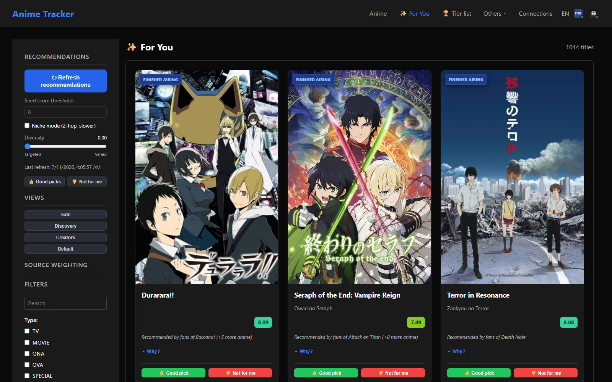
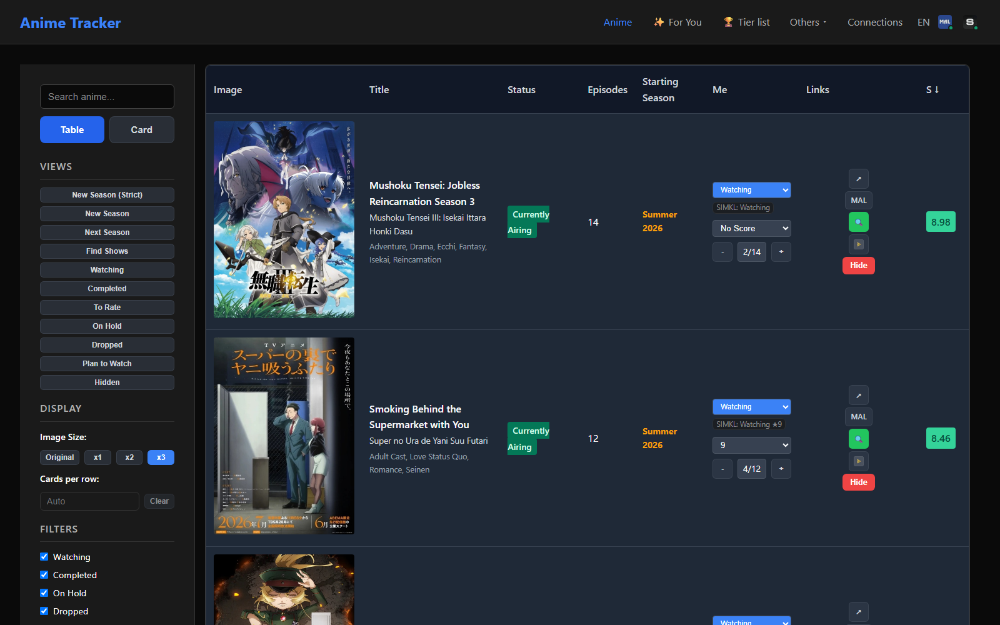

# Anime Tracker

> A self-hosted anime tracking app that unifies **MyAnimeList**, **SIMKL**, and **AniList** into one catalog — with a taste-aware recommendation engine, a drag-and-drop rating board, and cross-source discrepancy detection.

<p>
  
  
  
  
  
</p>

Built with **Next.js 14 (Pages Router)** and **TypeScript**, deployed via **Docker** on a Synology NAS. It's a single-user, self-hosted app optimized for a living-room TV browser at 4K — dark theme, keyboard/remote friendly — but it runs anywhere.

The whole thing ships with just **three runtime dependencies** (`next`, `react`, `react-dom`). The i18n layer, URL state management, drag-and-drop rating board, and the recommendation engine are all hand-rolled — no state library, no UI kit, no database.


---

## Features

### 📚 One catalog, three sources

The app merges three read-mostly data sources into a single unified record per title:

| Source | Role | What it contributes |
|---|---|---|
| **MyAnimeList** | Catalog authority | The anime catalog, mean scores, genres, studios, seasonal data, your personal list |
| **SIMKL** | Personal-state authority | Your watch status, scores, and episode progress (SIMKL wins over MAL for personal fields) |
| **AniList** | Metadata enrichment | A rich tag taxonomy (relevance-ranked), full staff credits, landscape banner art, and crowd recommendations |

The architecture is **local-cache-authoritative**: the merged local record is the source of truth, and each remote is an interchangeable, absent-tolerant refill pipe. Every record also carries a cross-source **identifier crosswalk** (MAL · SIMKL · AniList · AniDB · Kitsu · TMDB · IMDB).

### ✨ "For You" — a taste-aware recommendation engine

Not a filter — a **computed candidate set with affinity ranking**. Each candidate is scored as an additive weighted sum across independent signals:

- **Crowd recommendations** from both MAL and AniList (the anchor — these inject candidates)
- **Taste-profile affinity** on genres, studios, AniList tags, and shared staff — all **IDF-weighted**, so a rare shared studio or director counts for far more than a common genre
- **Feedback loop** — 👍 "good pick" / 👎 "not for me" verdicts re-rank future results *and* reshape the candidate pool (your 👍s become recommendation seeds)
- **Negative signals** — popularity and rejection profiles push generic or disliked titles down

Every card explains itself: a **"Why?"** breakdown shows exactly which signals fired ("Recommended by fans of Attack on Titan", shared tags, shared staff…). All source weights are live-tunable sliders and persist in the URL.



### 🏆 Tier list — a drag-and-drop rating board

Ten score rows (green → red, with MAL's word labels) plus an "to rate" tray. **A tier is a score**: drop a card into a row and it writes that score to **both MAL and SIMKL** to keep them in sync. Optimistic updates with revert-on-failure, a serial write queue that respects SIMKL's rate limits, and a red badge if a remote write didn't take.


### 🔍 Rich detail pages

Every title gets a full-bleed AniList banner backdrop, a **"Personal state" panel comparing MAL vs SIMKL vs the effective value**, a MAL catalog sheet, the full AniList tag + staff taxonomy, the identifier crosswalk, and two similarity blocks:

- **"More like this"** — the same weighted-source engine re-ranking this title's crowd edges around the *single anchor*
- **"Same studio / staff"** — a pure catalog-wide credit-similarity search


### ⚖️ MAL / SIMKL discrepancy detection

Because two personal-data sources drift, the app continuously compares status, score, and progress across MAL and SIMKL and surfaces mismatches — as a per-card badge, a filter on the main list, and a dedicated comparison page.


### 🗂️ Table or card layout, everything URL-driven

Toggle between an information-dense table and a poster grid. Both share the same filter sidebar, and **all filter and display state lives in the URL query string** — every view is a shareable, bookmarkable link, and the browser back button just works.



### Plus

- **🔄 Sync orchestration** — lightweight personal-list sync, a full seasonal "big sync" crawling ~8 years of seasons (plus a historical crawl back to 1960), and AniList metadata enrichment, all with live SSE/log progress.
- **🌍 Switchable FR / EN** — a dependency-free i18n layer where French is the canonical key set (a missing English key is a *compile error*).
- **🧮 Rating calculator** — a guided rubric at `/rate` for scoring a title consistently.
- **⏰ Cron-friendly** — an authenticated `cron-sync` endpoint for scheduled background syncs on the NAS.

---

## Architecture highlights

- **URL is the single source of truth.** Filters and display state are parsed from and pushed to the query string; there is no client state store. Presets are just URL templates.
- **No database.** All data persists as plain JSON files under `DATA_PATH`, joined in-process into a unified display record with a short-lived cache that's explicitly invalidated on every write.
- **Local-cache authority.** Three helpers (`getEffectiveStatus` / `getEffectiveScore` / `getEffectiveProgress`) resolve personal fields SIMKL-first with MAL fallback, so every personal read goes through one seam.
- **CSS Modules with generated typings** for components; scoped `<style jsx>` for one-off page layout. Colors come from CSS custom properties.

## Tech stack

**Next.js 14** (Pages Router) · **TypeScript** (strict) · **React 18** · **CSS Modules** + typed-css-modules · **Docker** (standalone output). External APIs: MyAnimeList, SIMKL, AniList (GraphQL).

---

## Getting started

```bash
npm install
npm run dev      # dev server + CSS type watcher
```

Other commands:

```bash
npm run build      # generate CSS types, then next build
npm run lint       # ESLint
npm run css:types  # regenerate CSS Module typings (run after any .module.css change)
```

## Docker deployment

Multi-stage build with `next build --output standalone`, exposed on port `12344:3000`, with volume mounts for `/app/data` and `/app/logs`.

```bash
# ensure data + logs directories exist on the host, then:
docker-compose up -d
```

## Environment variables

| Variable | Purpose |
|---|---|
| `DATA_PATH` | Root for JSON data files (default `/app/data`) |
| `LOGS_PATH` | Logs directory |
| `MAL_CLIENT_ID` | MyAnimeList OAuth app client ID ([get one](https://myanimelist.net/apiconfig)) |
| `MAL_REDIRECT_URI` | MAL OAuth redirect URI |
| `CRON_SECRET` | Auth token for the cron-sync endpoint |
| `SIMKL_CLIENT_ID` | SIMKL OAuth app client ID |
| `SIMKL_CLIENT_SECRET` | SIMKL OAuth token exchange secret |
| `SIMKL_APP_NAME` | Sent as `app-name` + `User-Agent` on SIMKL requests |
| `SIMKL_REDIRECT_URI` | SIMKL OAuth redirect URI |
| `BUILD_VERSION` | *(optional)* forces cache busting |

Copy `.env.example` to `.env.local` and fill these in.

---

*A single-user, self-hosted project. MAL and SIMKL connections are personal OAuth links established from the in-app **Connections** page.*
